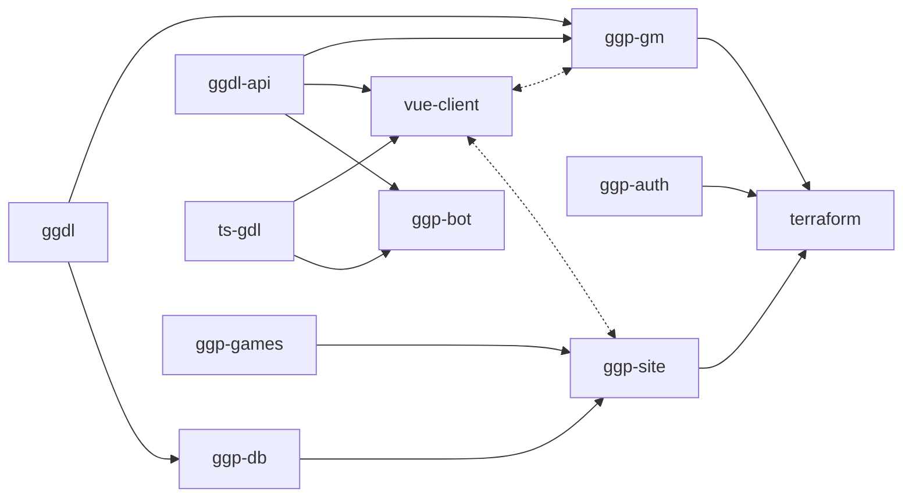

# Symbol Not Found

Currently developing General Game Playing (GGP) software and code generating tools.

After a rather broad survey of what defines a game, including single-player puzzles
and games involving 2 or more players, games with and without chance elements, games
that involve simultaneous play and those that are turn-based, games that are played
with a board & pieces, or cards, or dice, or with symbols, or all of those, games of
perfect knowledge and those that are only partially seen, games that expect knowledge
had by the players before the game started... and some idiosyncratic games as well...
with a little over 200 games it barely scratches the surface of all published games
but it covers almost as broad an area:

https://docs.google.com/spreadsheets/d/1Qcg707g7wGSvr1XKr5UNmLDlcYtoZ3GTNwtUPL3bo5U

The goal is to implement several of these (as many as we can!) in a common grounding
-- a logic-language extension of GDL with added semantics for boards, equipment, dice,
decks, etc.  The initial motivation was to have a system from which a human-friendly
game interface could be code-generated (including hints for assistive technology, as
well as the entire client/server protocol for network play), along with a playable AI.
Games can be played (human or AI) vs (human or AI) for all roles defined in the game.

The motivation has expanded to include other reasons -- there are games on that list
which have been almost entirely lost, a couple of games are only guesses, their rules
reverse-engineered from scant evidence discovered in archeological finds.  Some games
have dozens or hundreds of variants only a handful of which have been converted into a
form where they might be preserved.  Many games exist in one platform/environment but
not anywhere else, and typically not in a declarative/logical representation but in a
general purpose procedural language (if the original source is available at all).
Building a general game description language and collection of games is another way to
help preserve games, both ancient and modern, and make them widely accessible.

The initial motivation of code-generating the play-protocol and interface was also to
provide a testing ground for the design and fine-tuning of new games.  Play-testing a
new game takes precious hours of seasoned game players and must be repeated after every
gameplay-balance adjustment.  By defining the game rules as logical relations, there
is the immediate benefit of avoiding an entire class of bugs from accidents of editing
the client and server implementations.  There is the ability to play against an AI that
is at least capable of legal moves and makes occasionally clever moves.  There are
automated metrics that can be derived from equipment & rule complexity, the initiative
advantage, difficulty, determinism, validity, convergence, etc. that can help a game
designer.  Some metrics are determined from self-play, these same metrics are latent
features which playtesting attempts to derive.  Some automated playtesting can save
hours or days of unbalanced play, per game being developed!  With the appropriate
measures, the system could even give guidance where equipment or rules are particularly
unfair.

This motivation expanded also into a desire to build the venue where intelligence
and reasoning engines can compete.  Although AI have mastered very deep games such
as Chess and Go, even learning games without being told any specific strategy or
even the explicit rules, these systems have required many hundred hours and enormous
compute resources to learn one game.  The most general language models could probably
score well in a quiz game or word-based game, and even generate some code to play
tic-tac-toe, but they aren't nearly ready to play at any game with arbitrary rules
and goals.  Will a stronger reasoning engine emerge?  A true AGI could be expected
to develop a competitive interface, I think.  In the meantime, I have a few sub-par
engines that have relative strengths and invite others to contribute competitors
when the site is launched later this year!

## Repository dependencies (arrow indicates direction of import into)

## Summary of repositories

### [ggdl]: GGDL parser in Go

A parser and compiler for .ggd source files (GGDL's file type), a superset of
GDL and with the semantics of many of the language's variants.  It can transpile
GGDL into GDL-II (or, in some cases, rtGDL) and will compile to GDL-I if able.
There is an alternate repository, [gdl-ts], for parsing and evaluating GDL game
descriptions and providing hooks for player actions and game updates.

This repo has github actions for compiling the parser and benchmarking its parse
times for priority operations (e.g. ground relations used in player moves).

### [ts-gdl]: GDL and μGGDL parser in TypeScript

A parser and compiler for GGDL games as well as GDL-KIF and GDL-HRF formats of
Stanford's GDL language.  Intended for use by the Vue3 client but also suitable
for standalone frontends that aim for compatibility with multiple games, including
third-party implementations of competitive AI players.  Includes rule processing
and a basic Knowledge Base representation.

This repo will include build and packaging rules for making the library available
for distribution via NPM.  Should also include github actions for running the test
suite as a pre-merge step.

### [ggdl-api]

The common protocols and data types that all players (both human and AI),
as well as game master and lobby interfaces, use to interact.  These are
defined as a separate repo because some environments do not need an entire GGDL 
compiler to operate (e.g., the game clients that have been code generated from
rules).  This is not to say that clients should not depend on `ggdl`, but that
there are benefits to building clients that only need to depend on the API.

This repo has no github actions, but has hooks into build and test that check
for internal consistency.

### [ggp-gm]

A golang service adhering to the Game Manager for hosting games.
It coordinates the simultaneous play of moves, shares game updates with players
and spectators, and validates legal play adhering to the game's rules.  Though
it depends on `ggdl-go` so that it can arbitrate any bespoke games, some of the
game rules may be a compiled into go plugins for native compilation into Go,
compiled into an intermediate notation that the service can snapshot and read
back in when play resumes.

This repo has github actions for staging the GM to be released.

The protocol deviates from that of IGGPC described in [GDL](https://www.cs.uic.edu/~hinrichs/papers/love2006general.pdf),
mainly so that it can be easier for a human to interact with via a browser,
but it should be possible to create a compatibility layer to satisfy any bot
that had been developed specifically for IGGPC or [Stanford's GGP](https://games.ggp.org).

### [ggp-db]

Maintains the list of games, game metadata and game history for
recent matches.  Is defined in a game-agnostic way and compatible with OpenAuth
ID servers to provide ACLs across any arbitrary game definition or game state
representation.  Clients do not need to know how the metadata and replay data
are stored, only how to retrieve and parse it as described in `ggdl-api`.  This
is the reference implementation for database-related operations in the API.

### [ggp-games]

A (private) repository containing the game rulesets and backup
of the wiki content residing at [GGP Dojo](https://ggpdojo.com/games).  This is
the backing store for games while they are in progress and is periodically
synced with the servers running the ggpdojo site.  Game metadata will include
a `'status'` property indicating whether it should be shown in the index or only
available to beta testers, etc.

This has no github actions.  The release of any component that reads the
game definitions (GGP-GM & clients) may block if unable to parse a game
that has been released and has a stable status.  Making game parsing a submit
blocker sounds interesting but would be a challenge in this multi-repo setup
and without a stable game player, game GM and fuzzer.  Maybe with a release
binary of the ggdl-check binary?  We will consider it.

### [ggp-site]

Web site frontend for ggpdojo.com and OAuth callback receiver, presenting the
interface for viewing current games, creating new lobbies, or joining with
a lobby invitation.  Thus it only needs to depend on `ggdl-api` and `ggp-db`, it
is the GM's responsibility to arbitrate game logic decisions.  There is also a
dependency on `ggp-client` because ggpdojo.com is a convenient location to
deploy it from.  However, that dependency is at deployment time, not during build.

There are github actions for staging a release of the Frontend server.

### [vue-client]

This is a quasar- and Vue3-based Single Page Application of a client for human
players in GGP Dojo.  Because quasar allows for building several modalities,
a variety of compilation targets could exist.  Initial target platforms are web
browser and mobile apps.  Desktop clients are possible by extending this repo
via electron and cordova, however for some platforms it may be easier or more
performant to only depend on the protocol schema for the client, see `ggdl-api`.

There are no github actions, this repo is built and included in the images
deployed for the Frontend (ggp-site).

### [ggp-bot]

Reference implementation for a competitive AI that can play most small games
optimally and some large games decently.  Depends on `ggdl-api` for joining
and playing games, depends on `ts-gdl` for compiling into an intermediate
representation.  The intent here is not to have the most competitive AI player
but to accelerate the path for those who want to explore creating one.

This repo also has the github actions for staging a release in its cluster.

[ggdl]: https://github.com/SymbolNotFound/ggdl

[ts-gdl]: https://github.com/SymbolNotFound/ts-gdl

[ggdl-api]: https://github.com/SymbolNotFound/ggdl-api

[ggp-gm]: https://github.com/SymbolNotFound/ggp-gm

[ggp-db]: https://github.com/SymbolNotFound/ggp-db

[ggp-games]: https://github.com/SymbolNotFound/ggp-games

[ggp-site]:  https://github.com/SymbolNotFound/ggp-site

[vue-client]:  https://github.com/SymbolNotFound/vue-client

[ggp-bot]:  https://github.com/SymbolNotFound/ggp-bot
