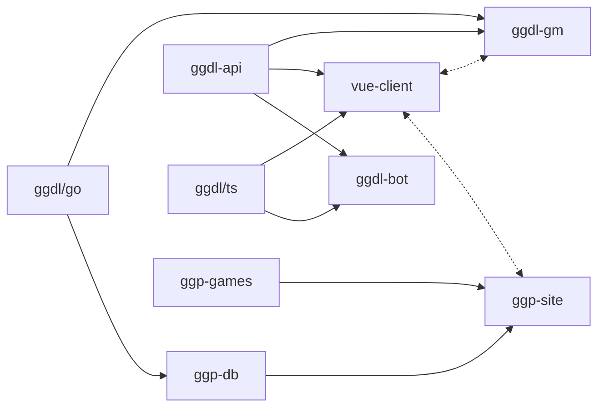

# Currently developing General Game Playing (GGP) software

After a rather broad survey of what defines a game, including single-player puzzles
and games involving 2 or more players, games with and without chance elements, games
that involve simultaneous play and those that are turn-based, games that are played
with a board & pieces, or cards, or dice, or with symbols, or all of those, games of
perfect knowledge and those that are only partially seen, games that expect knowledge
had by the players before the game started... and some idiosyncratic games as well...
with a little over 200 games it barely scratches the surface of all published games
but it covers nearly as broad an area:

https://docs.google.com/spreadsheets/d/1Qcg707g7wGSvr1XKr5UNmLDlcYtoZ3GTNwtUPL3bo5U

The goal is to implement several of these (as many as we can!) in a common grounding
-- a logic-language extension of GDL that includes board, equipment, deck, dice, etc.
semantics.  The initial motivation was to have a system from which a human-friendly
game interface could be code-generated (including hints for assistive technology, as
well as the entire client/server protocol for network play).  The motivation has also
blossomed into a desire to build the venue where intelligence and reasoning engines
can compete.  Though AI have mastered Chess and Go, even learning games without being
told any specific strategy or even explicit rules, these systems have required many
hundred hours and enormous compute resources to learn one game.  The most general
language models could probably score well in a quiz game or word-based game, and
even generate some code to play tic-tac-toe, but they aren't nearly ready to play at
any game with arbitrary rules and goals.  Will a stronger reasoning engine emerge?
A true AGI could be expected to develop a competitive interface, I think.  In the
meantime, I have a few subpar engines that have relative strengths and invite others
to contribute competitors when the site is launched later this year!

## Summary of repositories

### **ggdl**: Generative Game Description Language

A parser and compiler for .ggd source files (GGDL's file type), a superset of
GDL and compatible with several of the language's variants.  It can compile
GGDL down to GDL-II (or, if necessary, rtGDL) and will compile to GDL-I if able.
Contains a parser/compiler for both golang and TypeScript, developed in tandem.
This repo has github actions for compiling the parser and benchmarking its parse
times for priority operations (e.g. ground relations used in player moves).

### **ggdl-api**:

The common protocols and data types that all players (human and
AI), as well as game master and lobby interfaces, use to interact.  These are
defined as a separate repo because some environments do not need an entire GGDL 
compiler to play (e.g., the game clients that have been code generated from
rules).  This is not to say that clients should not depend on `ggdl`, but that
there are benefits to building clients that only need to depend on the API.
This repo has no github actions, but has hooks into build and test that check
for internal consistency.

### **ggdl-gm**:

A golang service adhering to the Game Manager for hosting games.
It coordinates the simultaneous play of moves, shares game updates with players
and spectators, and validates legal play adhering to the game's rules.  Though
it depends on `ggdl/go` so that it can arbitrate any bespoke games, some of the
game rules may be a compiled into go plugins for native compilation into Go,
compiled into an intermediate notation that the service can snapshot and read
back in when play resumes.
This repo has github actions for staging the GM to be released.

### **ggp-db**:

Maintains the list of games, game metadata and game history for
recent matches.  Is defined in a game-agnostic way and compatible with OpenAuth
ID servers to provide ACLs across any arbitrary game definition or game state
representation.  Clients do not need to know how the metadata and replay data
are stored, only how to retrieve and parse it as described in `ggdl-api`.  This
is the reference implementation for database-related operations in the API.

### **ggp-games**:

A (private) repository containing the game rulesets and backup
of the wiki content residing at [GGP Dojo](https://ggpdojo.com/games).  This is
the backing store for games while they are in progress and is periodically
synced with the servers running the ggpdojo site.  Game metadata will include
a `'status'` property indicating whether it should be shown in the index or only
available to beta testers, etc.
This has no github actions; part of the release of any component that reads the
game definitions (e.g. GM, clients), that may block if unable to parse a game
that has been released and has a stable status.  Making game parsing a submit
blocker sounds interesting but would be a challenge in this multi-repo setup.
Maybe with a release binary of the ggdl-check binary?  Will consider it.

### **ggp-site**:

Web site frontend for ggpdojo.com and OAuth callback receiver.
It exposes the interface for viewing current games, creating new ones or joining
a lobby invitation.  Thus it only needs to depend on `ggdl-api` and `ggp-db`, it
is the GM's responsibility to arbitrate game logic decisions.  There is also a
dependency on `vue-client` because ggpdojo.com is a convenient location to
deploy it from, but that dependency is at deployment time, not during build.
It could be interesting to implement an SPA from within a game description... \
This repo also has the FrontEnd server's github actions for staging a release.

### **\*-client**:
A variety of compilation targets could exist, but the primary
target will be `vue-client` so that a playable client can be embedded in the
website alongside the wiki and public match listings.  Next planned are other
targets such as `flutter-client` and `steamvr-client`, which may only need to
depend on `ggdl-api`, as a reference implementations for clients that target a
pre-compiled set of game definitions.

### **ggdl-bot**:

Reference implementation for a competitive AI that can play
most small games optimally and some large games decently.  Depends on `ggdl-api`
for joining and playing games, depends on `ggdl/ts` for compiling a game into an
intermediate representation.  The intent is not to have the most competitive
AI player but to accelerate the path for those who want to explore creating one.
We will spend that time making a more effective tournament space so that the
best reasoning engine may emerge.
This repo also has the github actions for staging a release in its cluster.
