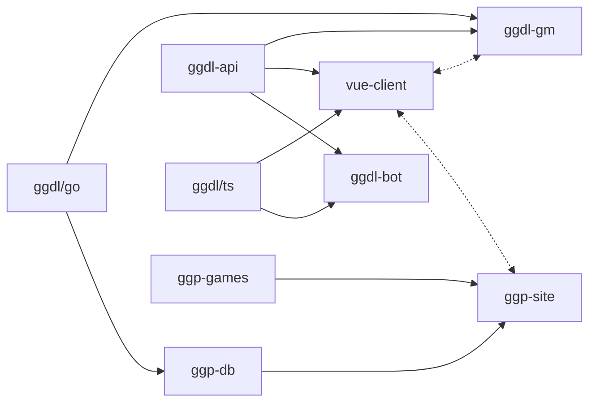

# This organization develops GGDL (Graphics & Game Description Language) and GGP (General Game Playing) software

```mermaid
graph LR;
    ggdl/go-->ggp-db;
    ggdl/go-->ggdl-gm;
    ggp-db--->ggp-site;
    ggdl-api & ggdl/ts --> ggdl-bot & vue-client;
    vue-client <-.-> ggp-site;
    vue-client <-.-> ggdl-gm;
    ggdl-api-->ggdl-gm;
    ggp-games--->ggp-site
```
